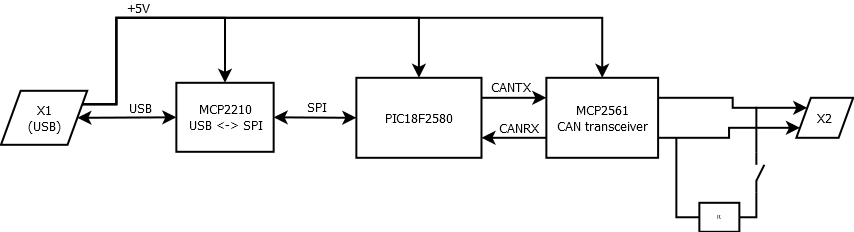

# Hardware
---

Fichiers de conception de la carte éléctronique. Le PCB a été réalisé avec le logiciel *eagle* de *CADsoft*.

+ [Schéma *fichier eagle SCH*](usb_can.sch)
+ [Schéma *fichier PDF*](usb_can_sch.pdf)
+ [Routage *fichier eagle BRD*](usb_can.brd)
+ [DOC](usb_can_doc_hard.pdf) (La documention de la carte a été réalisée avec *LaTeX*)

## Synoptique de la carte

Le coeur de l'interface est un PIC18F2580. Microcontroleur 8 bits, possédant un module bus CAN intégré.

La partie communication USB est réalisé par un MCP2210. Ce composant est une interface USB vers SPI qui nécessite très peu de composants pour être mis en oeuvre.

L'interface bus CAN (liaison matérielle) est réalisée par un MCP2561.

Enfin, un interrupteur sur la carte éléctronique permet de *terminer* ou non le bus avec une résistance de 120 Ohms.

